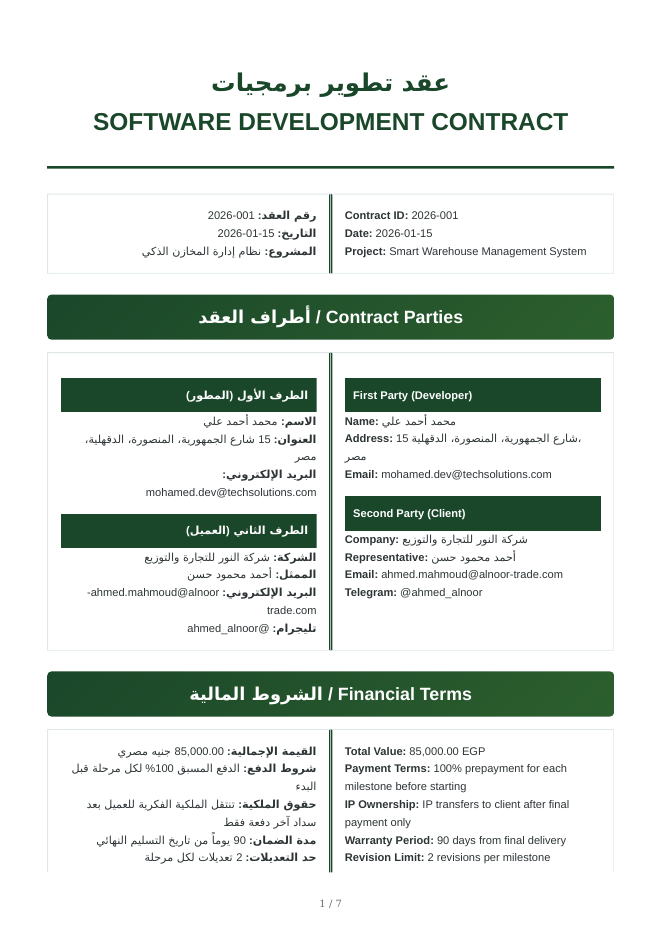

# Freelance Toolkit — مولّد العقود وبوت التسعير

> 🇬🇧 [English version](README.md) · 📖 [التوثيق الكامل](docs/DOCUMENTATION.ar.md)

حزمة أدوات بايثون للمطوّرين المستقلين تؤتمت مهمتين تستهلكان الوقت:

1. **مولّد العقود**: يحوّل ملف Excel إلى **عقود PDF احترافية ثنائية اللغة (عربي / إنجليزي)** بعرض صحيح من اليمين لليسار، مع بنود قانونية مصرية وهاش SHA-256 لسلامة العقد ورمز QR.
2. **بوت التسعير**: بوت **تيليجرام** (نص وصوت) يجمع أسعار السوق من Upwork وFreelancer وFiverr، ويحوّل الدولار إلى الجنيه المصري، ثم يرد على العميل برسالة نصية ورسالة صوتية.

<p align="center">
  
</p>

## المميزات

| الملف | وظيفته |
|---|---|
| `contract_generator.py` | يقرأ العقود والمراحل من Excel ويبني HTML/CSS ثم يصدّر PDF بـ WeasyPrint |
| `excel_generator.py` | ينشئ ملف Excel تجريبياً جاهزاً للتعديل (3 عقود مع مراحلها) |
| `telegram_bot.py` | بوت أسئلة شائعة مع تحويل الصوت إلى نص (Google Speech) والنص إلى صوت (gTTS) |
| `calculate_project_pricing.py` | كاشط أسعار بـ Selenium مع استخراج الأسعار وسعر الدولار مقابل الجنيه |
| `telegram_makes_pricing.py` | يدمج البوت والكاشط في تطبيق واحد |

## البدء السريع

```bash
git clone https://github.com/Hosam-Ashraf-Abdelfattah/freelance-toolkit.git
cd freelance-toolkit
python -m venv .venv && source .venv/bin/activate   # ويندوز: .venv\Scripts\activate
pip install -r requirements.txt
```

### 1) توليد العقود

```bash
python excel_generator.py        # ينشئ contracts_data.xlsx ببيانات تجريبية
python contract_generator.py     # ينشئ ملفات PDF داخل generated_contracts/
```

### 2) تشغيل بوت التسعير

```bash
cp .env.example .env             # ثم ضع TELEGRAM_BOT_TOKEN بداخله
python telegram_makes_pricing.py
```

بعدها أرسل للبوت مثلاً: `price of python web scraping`.

## المتطلبات

- Python 3.10 إلى 3.12
- مكتبات نظام **WeasyPrint** (Pango): راجع [دليل التثبيت](https://doc.courtbouillon.org/weasyprint/stable/first_steps.html)
- **FFmpeg** للرسائل الصوتية
- **Google Chrome** للكاشط

## هيكل المشروع

```
freelance-toolkit/
├── contract_generator.py
├── excel_generator.py
├── telegram_bot.py
├── calculate_project_pricing.py
├── telegram_makes_pricing.py
├── requirements.txt
├── .env.example
├── docs/                 # التوثيق الكامل (EN / AR) والصور
└── examples/             # Excel تجريبي وعقود PDF ومثال لنتيجة التسعير
```

## ملاحظات مهمة

- **ليست استشارة قانونية.** البنود القانونية قالب مبدئي، ويجب مراجعتها مع محامٍ مختص قبل الاستخدام الفعلي.
- **رابط التوقيع وهمي.** النطاق `https://contractsign.app` مجرد مثال، والمستودع لا يتضمن خادماً للتوقيع.
- **الكشط:** قد يخالف الوصول الآلي شروط استخدام المنصات، كما تتأثر النتائج بتغيّر تصميم الصفحات وبحماية مكافحة الروبوتات (غالباً لا يعيد Upwork شيئاً). استخدمه بمسؤولية واعتبر الأرقام تقديرات تقريبية.
- **الأسرار:** يُقرأ توكن البوت من ملف `.env`، ولا ترفعه أبداً إلى GitHub.

## الترخيص

MIT، راجع ملف [LICENSE](LICENSE).
