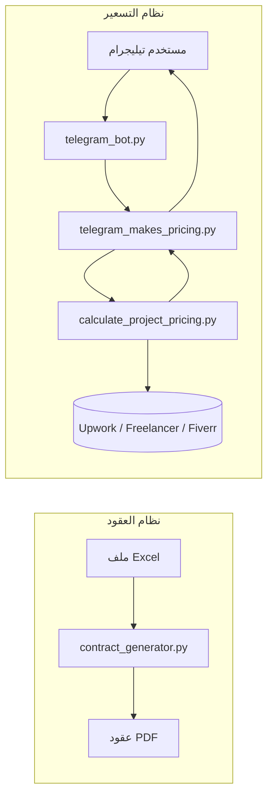
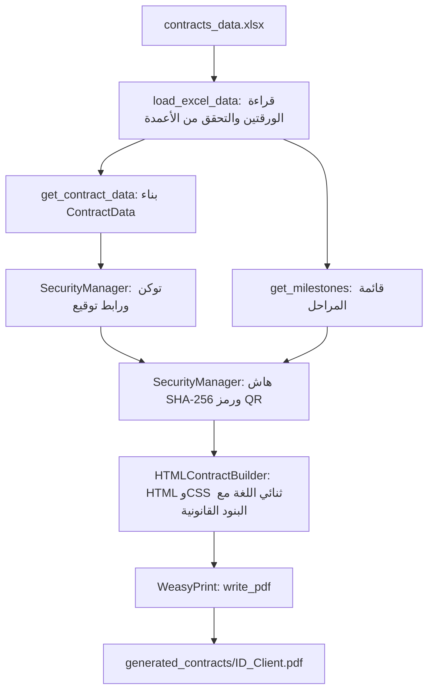
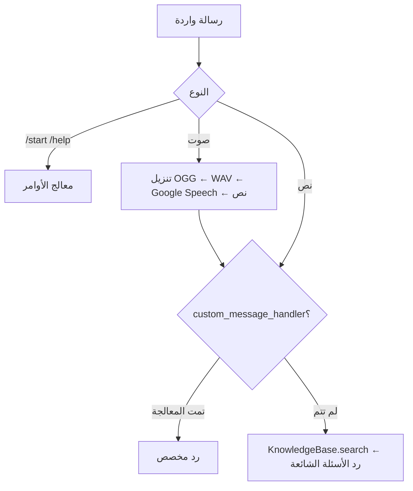

# Freelance Toolkit — التوثيق الكامل

> 🇬🇧 [English version](DOCUMENTATION.md) · [الرجوع إلى README](../README.ar.md)

## الفهرس

1. [نظرة عامة](#1-نظرة-عامة)
2. [التثبيت](#2-التثبيت)
3. [مولّد العقود](#3-مولّد-العقود)
4. [بوت تيليجرام](#4-بوت-تيليجرام)
5. [كاشط الأسعار](#5-كاشط-الأسعار)
6. [بوت التسعير المدمج](#6-بوت-التسعير-المدمج)
7. [القيود المعروفة](#7-القيود-المعروفة)
8. [حل المشكلات](#8-حل-المشكلات)
9. [أفكار للتطوير](#9-أفكار-للتطوير)

---

## 1. نظرة عامة

يحتوي المستودع على نظامين مستقلين:



| الملف | الدور |
|---|---|
| `contract_generator.py` | تحويل Excel إلى عقود PDF ثنائية اللغة |
| `excel_generator.py` | إنشاء ملف Excel تجريبي |
| `telegram_bot.py` | بوت تيليجرام قابل لإعادة الاستخدام (أسئلة شائعة وصوت) |
| `calculate_project_pricing.py` | وحدة كشط الأسعار |
| `telegram_makes_pricing.py` | تطبيق يجمع الاثنين |

---

## 2. التثبيت

**المتطلبات:** Python 3.10 إلى 3.12 وFFmpeg وGoogle Chrome ومكتبات نظام WeasyPrint.

```bash
python -m venv .venv
source .venv/bin/activate            # ويندوز: .venv\Scripts\activate
pip install -r requirements.txt
cp .env.example .env                 # أضف TELEGRAM_BOT_TOKEN
```

حزم النظام:

```bash
# Ubuntu / Debian
sudo apt install ffmpeg libpango-1.0-0 libpangoft2-1.0-0
# macOS
brew install ffmpeg pango
```

على ويندوز اتبع دليل WeasyPrint ثم ثبّت FFmpeg يدوياً.

---

## 3. مولّد العقود

### 3.1 طريقة العمل



1. يُقرأ ملف Excel بواسطة pandas. الورقة **الأولى** للعقود والورقة **الثانية** للمراحل (تُقرأ بالترتيب لا بالاسم).
2. يتم التحقق من الأعمدة المطلوبة، وإذا نقص عمود تعود رسالة خطأ بدل أن ينهار البرنامج.
3. لكل عقد يُنشأ توكن تحقق عشوائي (`secrets.token_urlsafe`) ورابط توقيع بصيغة `{base_url}/sign/{contract_id}?token={token}`.
4. يُحسب هاش SHA-256 على الحقول الأساسية للعقد والمراحل لاكتشاف أي تعديل لاحق، ويُضمَّن رمز QR لرابط التوقيع بصيغة base64.
5. يبني `HTMLContractBuilder` صفحة بعمودين (عربي/إنجليزي) ويضيف خمسة بنود قانونية، ثم يحوّلها WeasyPrint إلى PDF.
6. يُحفظ الملف باسم `<Contract_ID>_<Client_Name>.pdf` مع استبدال المسافات بشرطة سفلية.

### 3.2 تنسيق ملف Excel

**الورقة 1: العقود**

| العمود | مطلوب | ملاحظات |
|---|---|---|
| `Contract_ID` | ✅ | مثل `2026-001` |
| `Contract_Date` | ✅ | `YYYY-MM-DD` |
| `Project_Title` | ✅ | استخدم `النص العربي - English text` للعرض الثنائي |
| `Dev_Name` | ✅ | اسم المطوّر |
| `Client_Name` | ✅ | اسم العميل |
| `Total_Value` | ✅ | رقم |
| `Currency` | ✅ | مثل `EGP` أو `USD` |
| `Dev_Address` و`Dev_Email` و`Client_Rep` و`Client_Email` و`Client_Telegram` | اختياري | نص فارغ عند الغياب |
| `Payment_Terms` و`IP_Ownership` و`Warranty_Period` | اختياري | تُستخدم قيم عربية افتراضية |
| `Revision_Limit` | اختياري | الافتراضي `2` |
| `Governing_Law` | اختياري | الافتراضي: جمهورية مصر العربية |

يحتوي الملف التجريبي أيضاً على أعمدة مثل `Signing_Link` و`Verification_Token` و`Biometric_Auth_Status` و`Device_ID` و`IP_Log` و`Digital_Signature_Hash`. المولّد **لا يقرؤها**، بل يُنشئ قيماً جديدة عند كل تشغيل.

**الورقة 2: المراحل**

| العمود | مطلوب |
|---|---|
| `Contract_ID` | ✅ (يطابق الورقة الأولى) |
| `M_Order` | ✅ |
| `M_Title` | ✅ |
| `M_Price` | ✅ |
| `M_Duration` | ✅ (بالأيام) |
| `M_Description` | اختياري |

### 3.3 الاستخدام

```bash
python excel_generator.py          # إنشاء بيانات تجريبية
python contract_generator.py       # توليد كل العقود
```

كوحدة داخل كودك:

```python
from contract_generator import ContractGenerator

gen = ContractGenerator("contracts_data.xlsx", output_dir="generated_contracts")
ok, msg = gen.load_excel_data()
if ok:
    success, message, pdf_path = gen.generate_contract("2026-001")
    results = gen.generate_all_contracts()   # {id: (success, message, path)}
    meta = gen.get_contract_metadata("2026-001")
```

### 3.4 الكلاسات

| الكلاس | المسؤولية |
|---|---|
| `ContractData` و`Milestone` | Dataclasses لبيانات العقد والمراحل |
| `SecurityManager` | `generate_verification_token()` و`generate_contract_hash()` و`generate_signing_link()` و`generate_qr_code_base64()` |
| `LegalClausesEgypt` | بنود الإنهاء والسرية وحل النزاعات والقوة القاهرة والتوقيع الإلكتروني (عربي + إنجليزي) |
| `HTMLContractBuilder` | `get_css()` و`split_bilingual()` و`build_contract_html()` |
| `ContractGenerator` | `load_excel_data()` و`get_contract_data()` و`get_milestones()` و`generate_contract()` و`generate_all_contracts()` و`get_contract_metadata()` |

### 3.5 التخصيص

- **النص القانوني:** عدّل الدوال داخل `LegalClausesEgypt`.
- **التصميم:** عدّل الـ CSS الذي ترجعه `HTMLContractBuilder.get_css()`.
- **رابط التوقيع:** مرّر `base_url` الخاص بك إلى `SecurityManager.generate_signing_link()`. النطاق الافتراضي `https://contractsign.app` مجرد مثال.

> ⚠️ البنود قالب مبدئي وليست استشارة قانونية، ويجب مراجعتها مع محامٍ.

---

## 4. بوت تيليجرام

الملف `telegram_bot.py` بوت قابل للتشغيل منفرداً أو للاستيراد.

### 4.1 الإعداد

1. أنشئ بوتاً عبر [@BotFather](https://t.me/BotFather) وانسخ التوكن.
2. ضعه في `.env`: `TELEGRAM_BOT_TOKEN=...`
3. شغّل `python telegram_bot.py`.

إذا كان التوكن غير موجود يرفع البوت خطأً واضحاً عند البدء.

### 4.2 مسار الرسالة



### 4.3 الكلاسات

| الكلاس | المسؤولية |
|---|---|
| `MessageLogger` | يطبع كل حدث ويحفظه في طابور (`get_recent_messages`) |
| `VoiceProcessor` | `process_voice()` (تحويل OGG إلى WAV بـ pydub ثم `recognize_google`) و`text_to_speech()` (gTTS) |
| `KnowledgeBase` | قاموس كلمة مفتاحية ← إجابة. المحتوى الافتراضي **أمثلة** (support وhours وshipping…) يجب استبدالها |
| `TelegramBot` | معالجات `/start` و`/help` والنص والصوت، و`start_background()` و`stop()` و`send_message()` و`send_voice()` مع نسخ متزامنة |

### 4.4 الاستخدام كوحدة

```python
import threading
from telegram_bot import TelegramBot, KnowledgeBase

kb = KnowledgeBase({"hours": "مفتوح من 9 إلى 5", "contact": "me@example.com"})
bot = TelegramBot(knowledge_base=kb)

threading.Thread(target=bot.start_background, daemon=True).start()
bot.send_message_sync(chat_id=123456789, message="Hello!")
```

يمكنك أيضاً تمرير `custom_message_handler=your_async_function`. تستقبل الدالة `(bot, update, context)` ويجب أن ترجع `True` إذا عالجت الرسالة.

> التعرف على الصوت يستدعي `recognize_google` بلغته الافتراضية (الإنجليزية). للتعرف على العربية عدّل الاستدعاء داخل `VoiceProcessor.process_voice` إلى `recognize_google(audio_data, language="ar-EG")`.

---

## 5. كاشط الأسعار

الملف `calculate_project_pricing.py` يجمع أسعار السوق بمتصفح Chrome حقيقي.

### 5.1 طريقة العمل

1. يشغّل `FreelancePriceScraper` متصفح Chrome عبر `undetected-chromedriver` مع User-Agent عشوائي وسكربتات تخفٍّ بسيطة، وعند الفشل ينتقل لأنماط أبسط.
2. لكل منصة (`UpworkScraper` و`FreelancerScraper` و`FiverrScraper`) يفتح رابط البحث وينتظر بضع ثوانٍ ويجمع النصوص التي تحتوي على `$`.
3. يقسّم `PriceExtractor` الأسعار بالتعابير النمطية إلى **بالساعة** (من 5 إلى 500 دولار) و**ثابتة** (من 50 إلى 100,000 دولار). وإذا لم يجد شيئاً يخمّن بحسب القيمة والكلمات المجاورة مثل "hour".
4. تقرأ `ExchangeRateService` سعر الدولار مقابل الجنيه من xe.com أو Google، وتقبل القيم بين 20 و100 فقط، وإلا تعود إلى القيمة الاحتياطية `50.0`.
5. تكتب `save_to_json()` كل شيء في ملف JSON (انظر `examples/sample_pricing_output.json`).

### 5.2 الاستخدام

```python
from calculate_project_pricing import FreelancePriceScraper

scraper = FreelancePriceScraper(headless=True)
try:
    results = scraper.search_all("python web scraping")
    rate = scraper.get_usd_to_egp_rate()
    scraper.save_to_json(results, rate, "pricing.json")
finally:
    scraper.close()      # أغلق المتصفح دائماً
```

كل نتيجة قاموس يحتوي: `platform` و`url` و`hourly_rates` و`fixed_prices` و`hourly_avg` و`fixed_avg` (أو `error`).

### 5.3 إضافة منصة جديدة

```python
class MyPlatformScraper(PlatformScraper):
    def get_platform_name(self): return "MyPlatform"
    def get_search_url(self, query): return f"https://example.com/search?q={quote_plus(query)}"
```

ثم أضف نسخة منه إلى `self.scrapers` في `FreelancePriceScraper.__init__`.

> ⚠️ احترم شروط استخدام كل منصة. قد يكون الكشط ممنوعاً أو محجوباً.

---

## 6. بوت التسعير المدمج

الملف `telegram_makes_pricing.py` يعتمد **التركيب (Composition)**: يمرّر معالجه الخاص إلى `TelegramBot`.

1. يفحص `PricingRequestDetector` وجود كلمات إنجليزية مثل `price` و`cost` و`quote` و`how much` و`estimate`.
2. يزيل `ProjectTitleExtractor` العبارات الزائدة ("what is the price of…") ليستخرج عنوان المشروع.
3. يرد البوت "سيستغرق 30 إلى 60 ثانية"، ثم يشغّل الكاشط في خيط منفصل (executor) حتى يبقى البوت مستجيباً.
4. يبني `PricingResponseFormatter` تقريراً نصياً (لكل منصة مع المتوسط والوسيط العام بالدولار والجنيه) ونصاً صوتياً قصيراً.
5. يُحوَّل النص الصوتي بـ gTTS ويُرسل كرسالة صوتية، وتُحفظ النتيجة في `pricing_<timestamp>.json`.
6. أي رسالة ليست طلب تسعير تذهب إلى الأسئلة الشائعة العادية.

```bash
python telegram_makes_pricing.py
```

مثال للرسالة: `price of e-commerce website`.

---

## 7. القيود المعروفة

- **دقة الكاشط:** تُستخرج الأسعار من نص الصفحة الخام بتعابير نمطية، فقد تكون الأرقام مشوشة. ويحتفظ الكاشط بـ `sorted(prices)[:15]` أي **أقل 15 قيمة**، فتميل المتوسطات إلى الانخفاض.
- **Upwork** كثيراً ما لا يعيد بيانات بسبب الحماية من الروبوتات (انظر ملف JSON التجريبي).
- **سعر الصرف الاحتياطي** `50.0` قد يكون قديماً.
- **رابط التوقيع** وهمي، ولا يوجد خادم توقيع، وحقول "البصمة الحيوية" مجرد أعمدة بيانات.
- **الإنجليزية فقط** في كلمات التسعير والرد الصوتي.
- **لا توجد قاعدة بيانات ولا اختبارات** حتى الآن، وسجل الرسائل في الذاكرة فقط.

## 8. حل المشكلات

| المشكلة | الحل |
|---|---|
| `TELEGRAM_BOT_TOKEN is not set` | أنشئ `.env` من `.env.example` |
| النص العربي يظهر مقطّعاً في PDF | ثبّت Pango وتأكد من وجود خط يدعم العربية |
| `OSError: cannot load library 'pango…'` | ثبّت مكتبات نظام WeasyPrint |
| `FileNotFoundError: ffmpeg` | ثبّت FFmpeg وأضفه إلى `PATH` |
| أخطاء Chrome driver | حدّث Google Chrome، فـ `undetected-chromedriver` ينزّل التعريف المناسب |
| `ModuleNotFoundError: distutils` | نفّذ `pip install setuptools` |

## 9. أفكار للتطوير

- خدمة توقيع حقيقية (تطبيق ويب مع التحقق من التوقيع)
- كلمات تسعير ورد صوتي بالعربية
- استخدام واجهات برمجية رسمية أو مجموعات بيانات بدل الكشط
- اختبارات وCI عبر GitHub Actions
- حفظ العقود والسجلات في SQLite
- وسائط سطر أوامر (`--excel` و`--output`)
