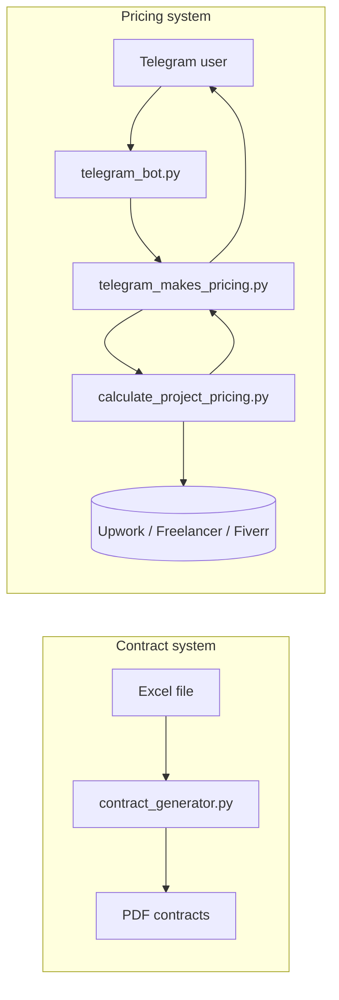
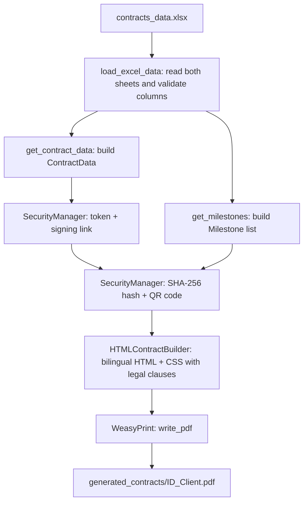
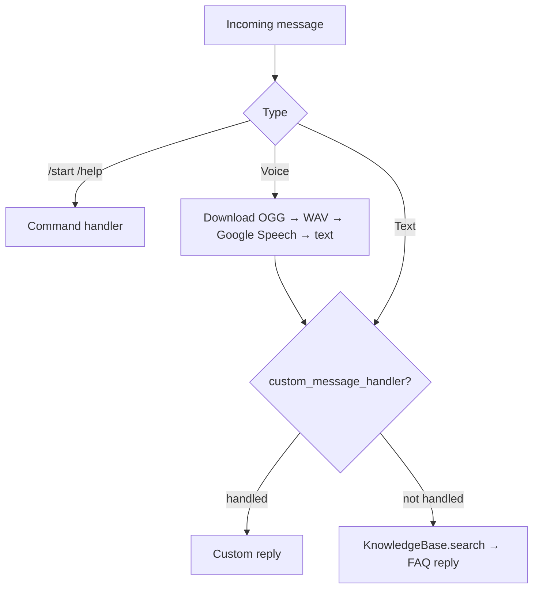

# Freelance Toolkit — Full Documentation

> 🇪🇬 [النسخة العربية](DOCUMENTATION.ar.md) · [Back to README](../README.md)

## Table of contents

1. [Overview](#1-overview)
2. [Installation](#2-installation)
3. [Contract Generator](#3-contract-generator)
4. [Telegram Bot](#4-telegram-bot)
5. [Pricing Scraper](#5-pricing-scraper)
6. [Unified Pricing Bot](#6-unified-pricing-bot)
7. [Known limitations](#7-known-limitations)
8. [Troubleshooting](#8-troubleshooting)
9. [Ideas for future work](#9-ideas-for-future-work)

---

## 1. Overview

The toolkit contains two independent systems that share one repository.



| File | Role |
|---|---|
| `contract_generator.py` | Excel → bilingual PDF contracts |
| `excel_generator.py` | Generates sample Excel input |
| `telegram_bot.py` | Reusable Telegram bot (FAQ, voice) |
| `calculate_project_pricing.py` | Reusable scraper module |
| `telegram_makes_pricing.py` | Application that combines the two |

---

## 2. Installation

**Requirements:** Python 3.10–3.12, FFmpeg, Google Chrome, and the WeasyPrint system libraries.

```bash
python -m venv .venv
source .venv/bin/activate            # Windows: .venv\Scripts\activate
pip install -r requirements.txt
cp .env.example .env                 # add TELEGRAM_BOT_TOKEN
```

System packages:

```bash
# Ubuntu / Debian
sudo apt install ffmpeg libpango-1.0-0 libpangoft2-1.0-0
# macOS
brew install ffmpeg pango
```

On Windows, follow the WeasyPrint guide and install FFmpeg manually.

---

## 3. Contract Generator

### 3.1 How it works



1. The Excel file is read with pandas. Sheet **1** holds contracts, sheet **2** holds milestones (sheets are read by position).
2. Required columns are validated; missing ones return an error message instead of crashing.
3. For each contract the generator creates a random verification token (`secrets.token_urlsafe`) and a signing link of the form `{base_url}/sign/{contract_id}?token={token}`.
4. A SHA-256 hash is computed over the key contract fields and milestones so any later change can be detected, and a QR code of the signing link is embedded as base64.
5. `HTMLContractBuilder` assembles a two-column Arabic/English page, adds five legal clauses, and WeasyPrint renders it to PDF.
6. The file is saved as `<Contract_ID>_<Client_Name>.pdf` (spaces replaced by underscores).

### 3.2 Excel format

**Sheet 1 — contracts**

| Column | Required | Notes |
|---|---|---|
| `Contract_ID` | ✅ | e.g. `2026-001` |
| `Contract_Date` | ✅ | `YYYY-MM-DD` |
| `Project_Title` | ✅ | Use `Arabic text - English text` for bilingual display |
| `Dev_Name` | ✅ | Developer name |
| `Client_Name` | ✅ | Client name |
| `Total_Value` | ✅ | Number |
| `Currency` | ✅ | e.g. `EGP`, `USD` |
| `Dev_Address`, `Dev_Email`, `Client_Rep`, `Client_Email`, `Client_Telegram` | optional | Empty string if missing |
| `Payment_Terms`, `IP_Ownership`, `Warranty_Period` | optional | Arabic defaults are applied |
| `Revision_Limit` | optional | Default `2` |
| `Governing_Law` | optional | Default: Arab Republic of Egypt |

The sample file also contains columns such as `Signing_Link`, `Verification_Token`, `Biometric_Auth_Status`, `Device_ID`, `IP_Log` and `Digital_Signature_Hash`. The generator **does not read** these; it creates fresh values on each run.

**Sheet 2 — milestones**

| Column | Required |
|---|---|
| `Contract_ID` | ✅ (must match sheet 1) |
| `M_Order` | ✅ |
| `M_Title` | ✅ |
| `M_Price` | ✅ |
| `M_Duration` | ✅ (days) |
| `M_Description` | optional |

### 3.3 Usage

```bash
python excel_generator.py          # create sample data
python contract_generator.py       # generate all contracts
```

As a module:

```python
from contract_generator import ContractGenerator

gen = ContractGenerator("contracts_data.xlsx", output_dir="generated_contracts")
ok, msg = gen.load_excel_data()
if ok:
    success, message, pdf_path = gen.generate_contract("2026-001")
    results = gen.generate_all_contracts()   # {id: (success, message, path)}
    meta = gen.get_contract_metadata("2026-001")
```

### 3.4 Classes

| Class | Responsibility |
|---|---|
| `ContractData`, `Milestone` | Dataclasses holding contract and milestone data |
| `SecurityManager` | `generate_verification_token()`, `generate_contract_hash()`, `generate_signing_link()`, `generate_qr_code_base64()` |
| `LegalClausesEgypt` | Termination, confidentiality, dispute resolution, force majeure and digital-signature clauses (AR + EN) |
| `HTMLContractBuilder` | `get_css()`, `split_bilingual()`, `build_contract_html()` |
| `ContractGenerator` | `load_excel_data()`, `get_contract_data()`, `get_milestones()`, `generate_contract()`, `generate_all_contracts()`, `get_contract_metadata()` |

### 3.5 Customising

- **Legal text:** edit the methods in `LegalClausesEgypt`.
- **Design:** edit the CSS returned by `HTMLContractBuilder.get_css()`.
- **Signing URL:** pass your own `base_url` to `SecurityManager.generate_signing_link()`. The default `https://contractsign.app` is only a placeholder.

> ⚠️ The clauses are a template, not legal advice. Have them reviewed by a lawyer.

---

## 4. Telegram Bot

`telegram_bot.py` is a reusable bot that can run alone or be imported.

### 4.1 Setup

1. Create a bot with [@BotFather](https://t.me/BotFather) and copy the token.
2. Put it in `.env`: `TELEGRAM_BOT_TOKEN=...`
3. Run `python telegram_bot.py`.

If the token is missing, the bot raises a clear error at start-up.

### 4.2 Message flow



### 4.3 Classes

| Class | Responsibility |
|---|---|
| `MessageLogger` | Prints each event and keeps it in a queue (`get_recent_messages`) |
| `VoiceProcessor` | `process_voice()` (OGG → WAV with pydub, then `recognize_google`), `text_to_speech()` (gTTS) |
| `KnowledgeBase` | Keyword → answer dictionary. The default entries are **placeholders** (support, hours, shipping…) that you should replace |
| `TelegramBot` | Handlers for `/start`, `/help`, text and voice; `start_background()`, `stop()`; `send_message()`, `send_voice()` and synchronous wrappers |

### 4.4 Using it as a module

```python
import threading
from telegram_bot import TelegramBot, KnowledgeBase

kb = KnowledgeBase({"hours": "Open 9am–5pm", "contact": "me@example.com"})
bot = TelegramBot(knowledge_base=kb)

threading.Thread(target=bot.start_background, daemon=True).start()
bot.send_message_sync(chat_id=123456789, message="Hello!")
```

You can also pass `custom_message_handler=your_async_function`. It receives `(bot, update, context)` and must return `True` if it handled the message.

> Voice recognition calls `recognize_google` with its default language (English). To recognise Arabic, edit that call in `VoiceProcessor.process_voice` to `recognize_google(audio_data, language="ar-EG")`.

---

## 5. Pricing Scraper

`calculate_project_pricing.py` collects market prices with a real Chrome browser.

### 5.1 How it works

1. `FreelancePriceScraper` starts Chrome through `undetected-chromedriver` with a random user agent and basic stealth scripts (falls back to simpler modes if that fails).
2. For each platform scraper (`UpworkScraper`, `FreelancerScraper`, `FiverrScraper`) it opens the search URL, waits a few seconds, and collects page text containing `$`.
3. `PriceExtractor` uses regular expressions to split prices into **hourly** ($5–$500) and **fixed** ($50–$100,000). If nothing matches, a heuristic guesses based on value and nearby words such as "hour".
4. `ExchangeRateService` reads the USD→EGP rate from xe.com or Google. Only values between 20 and 100 are accepted; otherwise it falls back to `50.0`.
5. `save_to_json()` writes everything to a JSON file (see `examples/sample_pricing_output.json`).

### 5.2 Usage

```python
from calculate_project_pricing import FreelancePriceScraper

scraper = FreelancePriceScraper(headless=True)
try:
    results = scraper.search_all("python web scraping")
    rate = scraper.get_usd_to_egp_rate()
    scraper.save_to_json(results, rate, "pricing.json")
finally:
    scraper.close()      # always close the browser
```

Each result is a dict: `platform`, `url`, `hourly_rates`, `fixed_prices`, `hourly_avg`, `fixed_avg` (or `error`).

### 5.3 Adding a platform

```python
class UpworkLikeScraper(PlatformScraper):
    def get_platform_name(self): return "MyPlatform"
    def get_search_url(self, query): return f"https://example.com/search?q={quote_plus(query)}"
```

Then add an instance to `self.scrapers` in `FreelancePriceScraper.__init__`.

> ⚠️ Respect each platform's terms of service and robots rules. Scraping can be blocked or prohibited.

---

## 6. Unified Pricing Bot

`telegram_makes_pricing.py` uses **composition**: it passes its own handler into `TelegramBot`.

1. `PricingRequestDetector` checks for English keywords such as `price`, `cost`, `quote`, `how much`, `estimate`.
2. `ProjectTitleExtractor` strips filler phrases ("what is the price of…") to get the project title.
3. The bot replies "this will take 30–60 seconds", then runs the blocking scraper in an executor thread so the bot stays responsive.
4. `PricingResponseFormatter` builds a text report (per platform + overall average and median, USD and EGP) and a short voice script.
5. The voice script is converted with gTTS and sent as a voice message; the result is also saved as `pricing_<timestamp>.json`.
6. Anything that is not a pricing request falls through to the normal FAQ.

```bash
python telegram_makes_pricing.py
```

Example message: `price of e-commerce website`.

---

## 7. Known limitations

- **Scraper accuracy.** Prices are extracted from raw page text with regular expressions, so numbers can be noisy. The scraper keeps `sorted(prices)[:15]`, which means the **15 lowest** values, so averages lean low.
- **Upwork** frequently returns no data (anti-bot protection). See the sample JSON.
- **Exchange-rate fallback** of `50.0` can be outdated.
- **Signing link** is a placeholder; there is no signing server, and "biometric" fields are only data columns.
- **English only** for pricing keywords and voice output.
- **No database or tests** yet; message logs live in memory.

## 8. Troubleshooting

| Problem | Fix |
|---|---|
| `TELEGRAM_BOT_TOKEN is not set` | Create `.env` from `.env.example` |
| Arabic text appears broken in PDF | Install Pango and make sure an Arabic-capable font is available |
| `OSError: cannot load library 'pango…'` | Install the WeasyPrint system libraries |
| `FileNotFoundError: ffmpeg` | Install FFmpeg and add it to `PATH` |
| Chrome driver errors | Update Google Chrome; `undetected-chromedriver` downloads the matching driver |
| `ModuleNotFoundError: distutils` | `pip install setuptools` |

## 9. Ideas for future work

- Real signing service (web app + e-signature verification)
- Arabic pricing keywords and Arabic voice replies
- Use official APIs or datasets instead of scraping
- Unit tests and CI (GitHub Actions)
- Store contracts and logs in SQLite
- Command-line arguments (`--excel`, `--output`)
